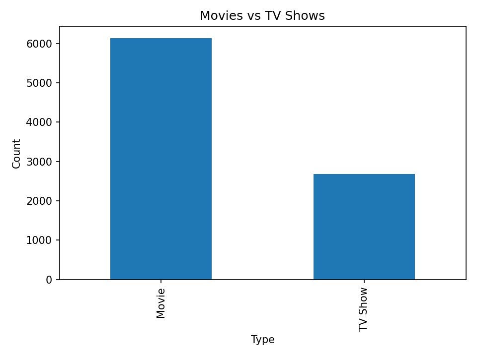
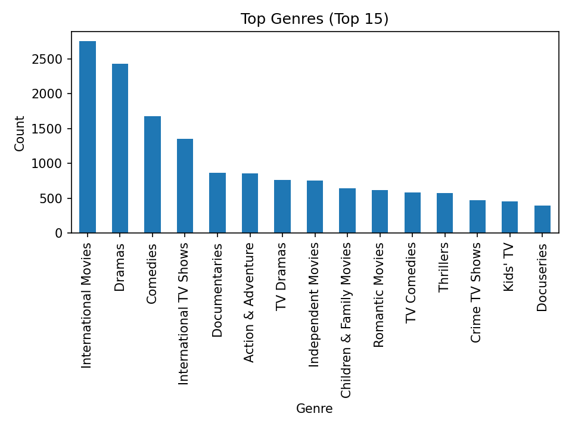
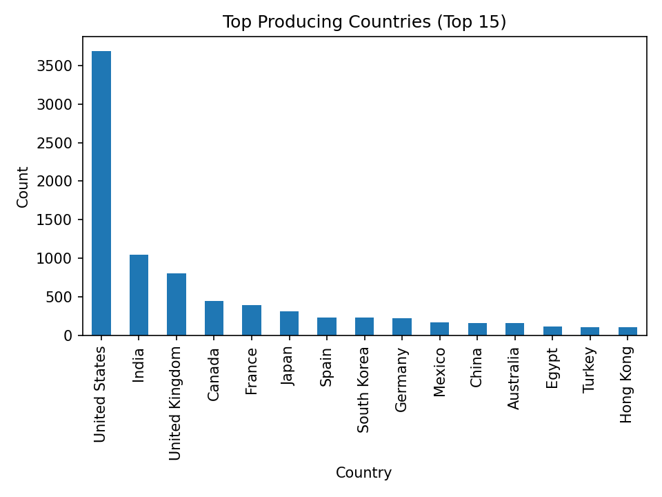
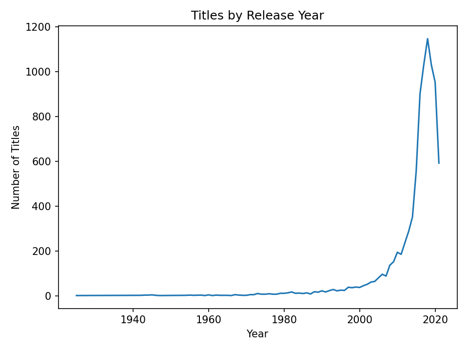
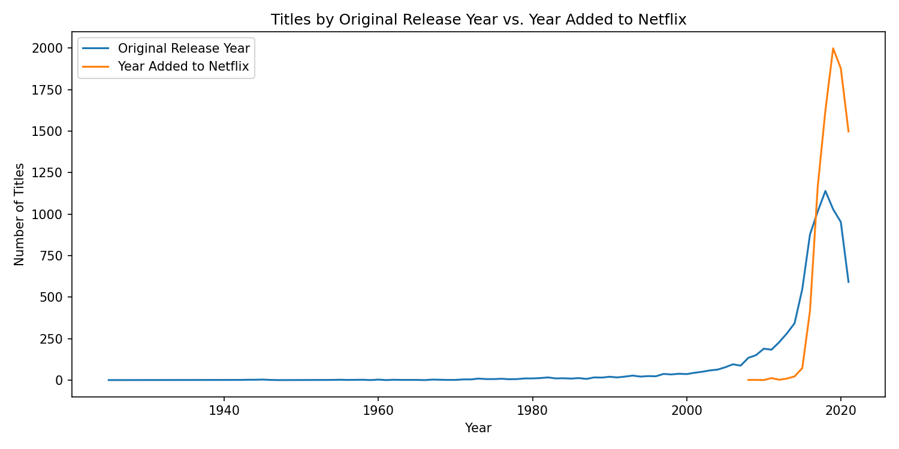
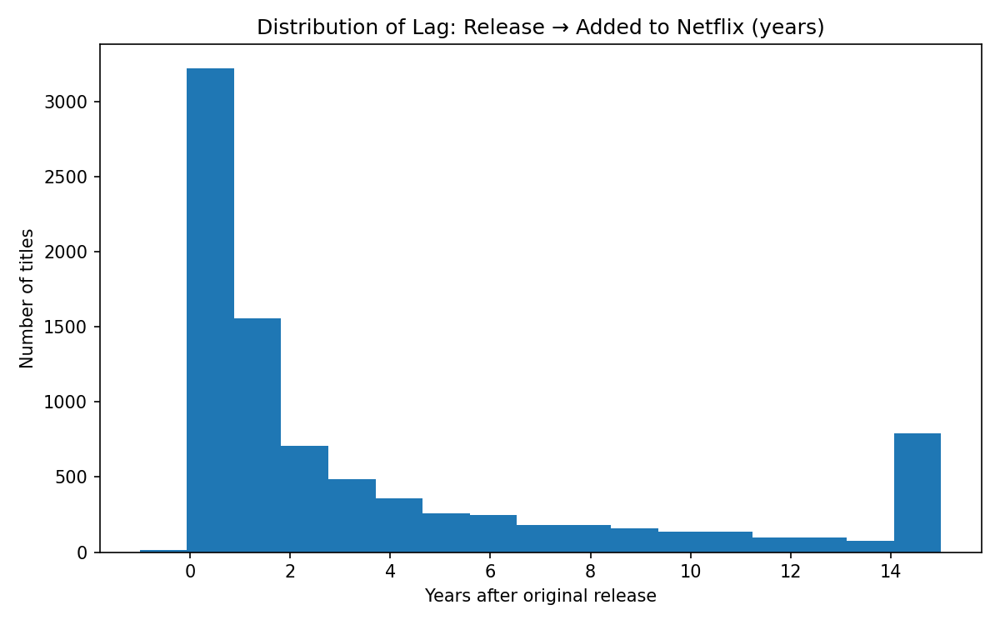

# Exploring Netflix Titles: Trends and Insights

This project analyzes the public **Netflix Titles** dataset to uncover trends in title types, genres, release years, and production countries.

## 📝 One-sentence takeaway
Titles rise fast from 2016 and peak in 2018; the later dip mostly reflects a ~1.0-year add-to-Netflix lag and the 2020 slowdown.

## 🔎 Key Insights
- Movies make up **70%** of titles (Movies: 6,131, TV Shows: 2,676).
- Top producing countries: **United States (3,689), India (1,046), United Kingdom (804)**.
- Top genres: **International Movies, Dramas, Comedies**.
- From 2016→2018 titles grew **27%** (from 902 to 1,147).

▶️ Open the analysis notebook: [notebooks/netflix_analysis.ipynb](notebooks/netflix_analysis.ipynb)

## Dataset
- Source: https://www.kaggle.com/shivamb/netflix-shows
- File to add: `data/netflix_titles.csv` (download from Kaggle and place it in the `data/` folder)

## How to Run
1. Open **Jupyter Notebook**.
2. Navigate to this project folder and open `notebooks/netflix_analysis.ipynb`.
3. Ensure `data/netflix_titles.csv` exists.
4. Run the notebook cells top-to-bottom. Charts will be saved to the `images/` folder.

## Questions Explored
- What’s the split between Movies and TV Shows?
- Which genres are most common?
- How has content grown over time?
- Which countries produce the most titles?

## Tech
- Python 3, pandas, matplotlib
- Jupyter Notebook

## 📈 Key Visuals

**Movies vs TV Shows**  

**Top Genres**  

**Top Producing Countries**  

**Titles by Release Year**  

**Release vs Added Year**  

**Lag Distribution**  

## Future Work
- Add more questions/insights
- Clean/feature-engineer columns (e.g., split `listed_in` into individual genres)
- Push to GitHub and share!
